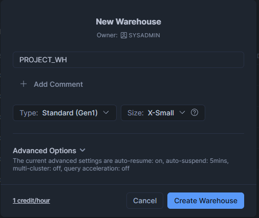
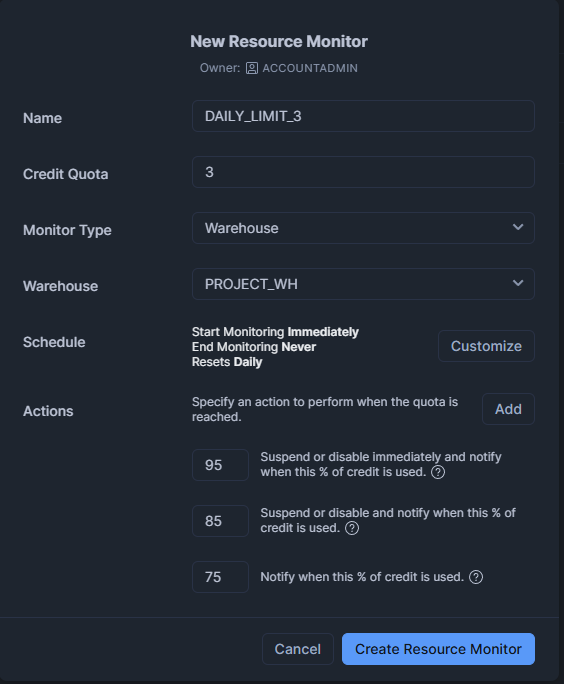
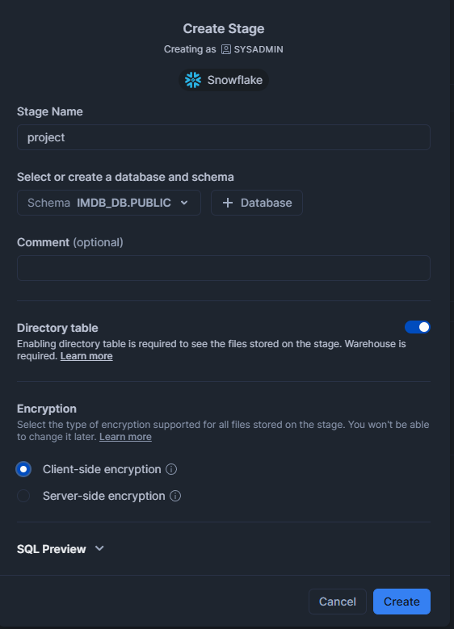
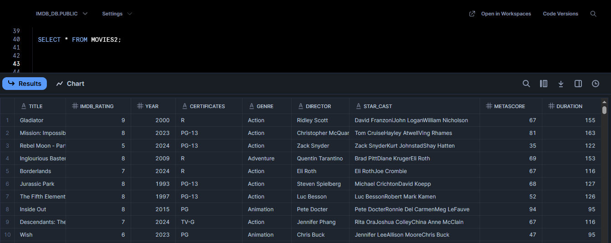
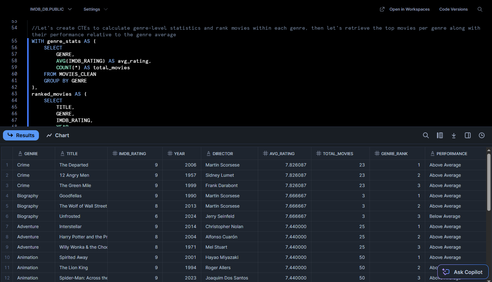

# IMDb Genre-Based Analysis with Snowflake  

This project demonstrates advanced SQL querying in **Snowflake**, focusing on analytical functions, CTEs (Common Table Expressions), and data curation using the **IMDb dataset**.  
The dataset was uploaded to a Snowflake stage, cleaned, and analyzed to extract insights about movie performance across genres.

## Project Structure  

- **`queries.sql`** — contains all SQL queries including:  
  - Creating and managing tables and file formats  
  - Removing duplicates with `SELECT DISTINCT`  
  - Using `WITH` and CTEs for multi-step analysis  
  - Applying window functions (`ROW_NUMBER`, `RANK`, `AVG`, `COUNT`)  
  - Using `CASE WHEN` logic for performance labeling  
  - Ordering and filtering results  

## Example Queries  

### 1. Setup
A warehouse (`PROJECT_WH`) and a resource monitor (`DAILY_LIMIT_3`) were created using the `ACCOUNTADMIN` role.  
We used an existing database:  
```sql
USE DATABASE IMDB_DB;
USE SCHEMA PUBLIC;
```
#### Results:



### 2. Stage creation and file upload

The CSV file (`IMDb_Dataset.csv`) was uploaded to a Snowflake stage named `@project`.

#### Results:


### 3. Create file format and load data into table
```sql
CREATE FILE FORMAT PROJECT_MOVIES_CSV
TYPE = 'CSV'
FIELD_DELIMITER = ','
SKIP_HEADER = 1
FIELD_OPTIONALLY_ENCLOSED_BY = '"';

COPY INTO MOVIES2
FROM @project
files = ('IMDb_Dataset.csv')
file_format = ( format_name=PROJECT_MOVIES_CSV );
```
#### Results:


### 3. Remove duplicates from the dataset  
```sql
CREATE TABLE MOVIES_CLEAN LIKE MOVIES2;

INSERT INTO MOVIES_CLEAN
SELECT DISTINCT *
FROM MOVIES2;
```
#### Results:
A cleaned table with unique movie entries, ensuring accurate genre-based calculations.

### 5. Combine genre statistics with ranked movies and classify performance
```sql
WITH genre_stats AS (
    SELECT 
        GENRE,
        AVG(IMDB_RATING) AS avg_rating,
        COUNT(*) AS total_movies
    FROM MOVIES_CLEAN
    GROUP BY GENRE
),
ranked_movies AS (
    SELECT 
        TITLE,
        GENRE,
        IMDB_RATING,
        YEAR,
        DIRECTOR,
        ROW_NUMBER() OVER (PARTITION BY GENRE ORDER BY IMDB_RATING DESC) AS row_num
    FROM MOVIES_CLEAN
)
SELECT 
    r.GENRE,
    r.TITLE,
    r.IMDB_RATING,
    r.YEAR,
    r.DIRECTOR,
    g.avg_rating,
    g.total_movies,
    r.row_num AS genre_rank,
    CASE 
        WHEN r.IMDB_RATING > g.avg_rating THEN 'Above Average'
        WHEN r.IMDB_RATING = g.avg_rating THEN 'Average'
        ELSE 'Below Average'
    END AS performance
FROM ranked_movies r
JOIN genre_stats g ON r.GENRE = g.GENRE
WHERE r.row_num <= 3
ORDER BY g.avg_rating DESC, r.GENRE, r.row_num;
```
#### Results:


## Tools Used:
- Snowflake — SQL execution
- Kaggle — Dataset source
- GitHub — Project repository

## Author:
Radu Gheorghe / murda2k — aspiring data analyst / SQL developer

## LinkedIn Profile:
https://www.linkedin.com/in/radu-gheorghe-a43704245/
